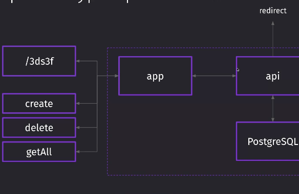

# k8s-app


Kubernetes manifests for a small URL shortener demo.

The app receives a long URL, stores it in Postgres, and returns a short link
that redirects to the original URL.

## Manifests

- `kubeconfig/app-deployment.yml` - application Deployment.
- `kubeconfig/app-service.yml` - application Service.
- `kubeconfig/ingress.yml` - demo Ingress.
- `kubeconfig/postgres-deployment.yml` - Postgres Deployment.
- `kubeconfig/postgres-service.yml` - Postgres Service.
- `kubeconfig/postgres-secret.example.yml` - example Secret manifest.

Create the database Secret before applying the Postgres Deployment:

```bash
kubectl -n test-app create secret generic postgres-credentials \
  --from-literal=password='<strong-local-password>'
```

Do not commit real database passwords or kubeconfig files.
